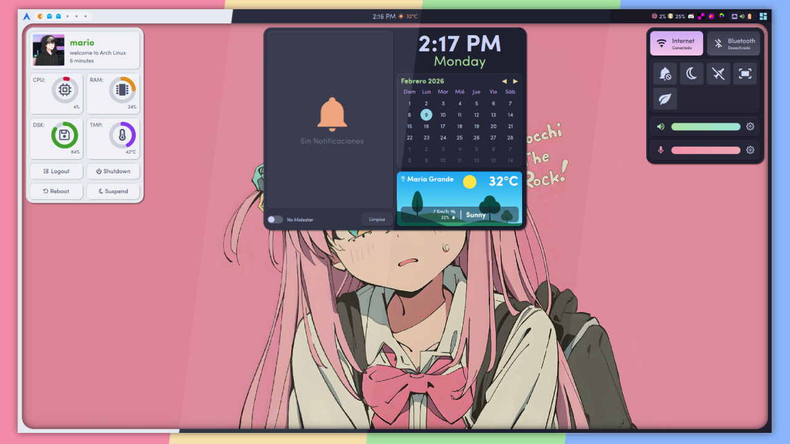

# 🌌 Ætheris-shell

> [!WARNING]
> ### ⚠️ Estado del Proyecto: Pre-Alpha / En Desarrollo
>
> **Ætheris-shell** se encuentra actualmente en una fase **muy temprana de desarrollo**.
>
> - **Inestabilidad:** Es probable que encuentres errores, cierres inesperados o comportamientos erráticos.
> - **Funciones Incompletas:** Muchas características no están implementadas o están a medio terminar.
> - **Cambios constantes:** La estructura y configuración pueden cambiar radicalmente sin previo aviso.
>
> *No se recomienda para uso diario en entornos de producción todavía.*

---



## 📝 Descripción

**Ætheris-shell** es una interfaz de shell moderna construida sobre **Quickshell** (QtQuick/QML), diseñada para integrarse visual y funcionalmente con **BSPWM** y **Hyprland**. El objetivo es reemplazar componentes tradicionales (como Polybar, Eww, Waybar) con una solución más fluida y animada basada en QML.

## 🚧 Características en Progreso

Actualmente se está trabajando en los cimientos del shell:

- **Gestión de Ventanas y Capas:** Implementación de scripts (como `fix_stacking.sh`) para asegurar que las barras y fondos de pantalla respeten el orden de apilamiento (Z-order) de BSPWM, manteniéndose por encima o por debajo de las ventanas según corresponda.
- **Barras de Estado:** Prototipos de barras informativas.
- **Wallpapers:** Gestión de fondos de pantalla renderizados por el propio shell.

## 🛠️ Requisitos

- **Quickshell**: Necesitas tener instalado el runtime de Quickshell.
- **BSPWM** (X11):
  - Dependencias de sistema: `xrandr`, `xwininfo`, `xprop`, `xdo` (utilizados por los scripts de ayuda).
- **Hyprland** (Wayland):
  - Dependencias de sistema: *Ninguna por el momento.*

## 🚀 Uso (Experimental)

### BSPWM

Para que **Ætheris-shell** funcione correctamente en BSPWM, es necesario contener lo siguiente en tu `bspwmrc`:

```bash
export XDG_CURRENT_DESKTOP=bspwm


# Asignar espacios de trabajo a cada monitor basándose en su nombre de hardware (xrandr)
# Esto es necesario para que Quickshell identifique las pantallas correctamente.

workspaces() {
    paste <(bspc query -M) <(xrandr --query | grep " connected" | awk '{print $1}') | \
    while read -r monitor_id monitor_name; do
        # Puedes cambiar el número de workspaces a gusto
        bspc monitor "${monitor_id}" -n "${monitor_name}" -d '1' '2' '3' '4' '5' '6'
    done
}

workspaces

quickshell &
```

### Hyprland
Para Hyprland, simplemente lanzalo al inicio.
```bash
exec-once = quickshell
```
