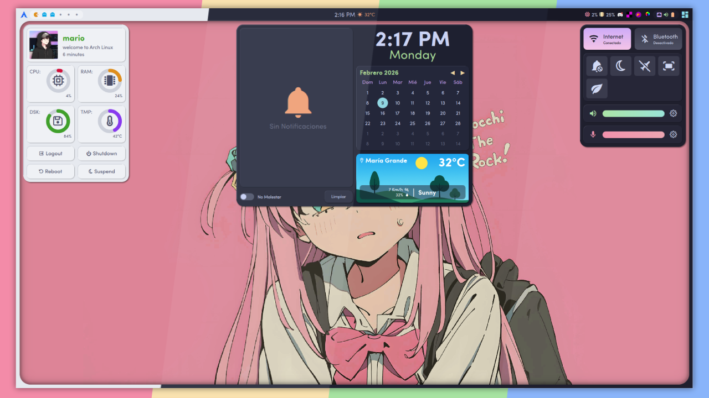

<div align="center">
  
```
 ▄▄▄      ▓█████▄▄▄█████▓ ██░ ██ ▓█████  ██▀███   ██▓  ██████ 
▒████▄    ▓█   ▀▓  ██▒ ▓▒▓██░ ██▒▓█   ▀ ▓██ ▒ ██▒▓██▒▒██    ▒ 
▒██  ▀█▄  ▒███  ▒ ▓██░ ▒░▒██▀▀██░▒███   ▓██ ░▄█ ▒▒██▒░ ▓██▄   
░██▄▄▄▄██ ▒▓█  ▄░ ▓██▓ ░ ░▓█ ░██ ▒▓█  ▄ ▒██▀▀█▄  ░██░  ▒   ██▒
 ▓█   ▓██▒░▒████▒ ▒██▒ ░ ░▓█▒░██▓░▒████▒░██▓ ▒██▒░██░▒██████▒▒
 ▒▒   ▓▒█░░░ ▒░ ░ ▒ ░░    ▒ ░░▒░▒░░ ▒░ ░░ ▒▓ ░▒▓░░▓  ▒ ▒▓▒ ▒ ░
  ▒   ▒▒ ░ ░ ░  ░   ░     ▒ ░▒░ ░ ░ ░  ░  ░▒ ░ ▒░ ▒ ░░ ░▒  ░ ░
  ░   ▒      ░    ░       ░  ░░ ░   ░     ░░   ░  ▒ ░░  ░  ░  
      ░  ░   ░  ░         ░  ░  ░   ░  ░   ░      ░        ░  
```
 

 
<p>
  <a href="./LICENSE"></a>
  <a href="https://quickshell.outfoxxed.me/"></a>
  <a href="https://ko-fi.com/mariorrom"></a>
</p>
<p>
  <a href="#-project-status"></a>
  <a href="https://github.com/MarioRRom/aetheris-shell/stargazers"></a>
</p>
</div>

> [!WARNING]
> ### ⚠️ Project Status: Pre-Alpha / Under Development
>
> **Ætheris-shell** is currently in a **very early stage of development**.
>
> - **Instability:** expect bugs, unexpected crashes, and erratic behavior.
> - **Incomplete features:** many parts are unimplemented or half-finished.
> - **Breaking changes:** structure and configuration may change radically without notice.
>
> *Not recommended for daily use in production environments yet.*

<div align="center">


<sub>📹 A demo video is planned for a future update.</sub>
</div>

## ✨ What is Ætheris-shell?

**Ætheris-shell** is a desktop shell built on top of **[Quickshell](https://quickshell.outfoxxed.me/)** (QtQuick/QML), created to give tiling window managers a cohesive, animated, and modern interface — without giving up the control and minimalism that draws people to tiling in the first place.

Instead of stitching together separate tools for bars, wallpapers, and window-manager glue scripts (Polybar, Eww, Waybar, and friends), Ætheris-shell aims to be **one coherent QML-driven layer** that talks directly to your WM/compositor, reacts to it in real time, and looks like it was designed on purpose.

The name comes from *Aether*, a character from a game whose story left a real mark on me, even after I stepped away from it. There are a few visual nods to that here and there, but recreating a game's UI was never the goal — the goal is to let ideas flow naturally into something detailed and comfortable to actually live in day to day. Above all, this project is about **sharing**: ricing is what got me into Linux in the first place, and Ætheris-shell is my way of putting a piece of that environment out into the world for others to use, tweak, and build on.

## 🖥️ Supported Environments
 
**Ætheris-shell** is planned to support a range of window managers and desktop environments, across both **X11** and **Wayland**. BSPWM is where most of the active development happens today, but the architecture isn't tied to it — Hyprland already runs, and more targets are on the roadmap as the shell matures.
 
| Environment | Display Server | Support Level |
|---|---|:---:|
| **BSPWM** | X11 | 🟢 Main target |
| **Hyprland** | Wayland | 🟡 Experimental |
| **i3** | X11 | ⚪ Planned |
| **Sway** | Wayland | ⚪ Planned |
 
**Legend:** 🟢 Main target, actively developed · 🟡 Experimental / usable but incomplete · ⚪ Planned, not started


## 🚧 Features

Under the hood, Ætheris-shell handles **window & layer management** on BSPWM — scripts like `fix_stacking.sh` keep bars and wallpapers respecting the window manager's Z-order, staying above or below windows as needed.

On top of that foundation, the shell is organized into modules, each responsible for one part of the experience:

- **`systeminfo`** — a user card plus a live system preview: CPU%, RAM%, disk usage, and temperature (°C/°F). Includes four power-control actions: logout, shutdown, reboot, and suspend.
- **`controlplayer`** — control any media player over **MPRIS**.
- **`Akasha`** *(center panel)* — the notification box, clock and date, a calendar, and a nicely designed weather card.
- **`controlcenter`** — the main hub for quick settings: networking menu, Bluetooth (WIP), volume and microphone sliders with sink/source selection, and a grid of toggle buttons still being planned/built out.
- **Wallpaper engine** — wallpapers are rendered by Quickshell itself, with support for **video wallpapers**. It also hosts small, non-interactive visual widgets on top of the wallpaper — currently a *Now Playing* card, with a clock, a VU meter, and other ambient widgets planned for the future.
- **`Irminsul`** *(the bar)* — currently a top bar only. Moving it to the bottom isn't planned for now, but isn't ruled out either.

### 🔮 Work in progress

- A **dock** at the bottom of the screen for quickly launching pinned apps and viewing currently open windows.
- A **Polkit authentication window** (actively being developed on a feature branch).
- A **settings window** to unify all of the shell's configuration in one place.
- **Battery & brightness support** for laptops.

## 🛠️ Requirements

- **[Quickshell](https://quickshell.outfoxxed.me/)** — the QML runtime Ætheris-shell is built on.
- **BSPWM** (X11):
  - System dependencies: `xrandr`, `xwininfo`, `xprop`, `xdo`, `picom` (used by the helper scripts).
- **Hyprland** (Wayland):
  - System dependencies: *none for now.*

## 🚀 Installation

### Quick install (dotfiles)

> [!NOTE]
> This repo contains only the **shell itself**. If you just want to install and run Ætheris-shell with a ready-to-use environment (configs, keybinds, autostart, etc.), head to the dotfiles repo instead:
>
> **➡️ Ætheris-dots (link coming soon — 🚧 work in progress)**
>
> The dotfiles repo will ship an automated installer that sets everything up for you. Use this path once it's available if you just want to run the shell without customizing it yourself.

If you plan to integrate Ætheris-shell into your **own** config, or want to contribute to development, keep reading below for manual installation.

### Manual installation
 
First, clone the repo and place its contents in `~/.config/quickshell`:
 
```bash
git clone https://github.com/MarioRRom/aetheris-shell ~/.config/quickshell
```
 
<details>
<summary><b>BSPWM setup</b></summary>

Add the following to your `bspwmrc`:
 
```bash
export XDG_CURRENT_DESKTOP=bspwm
 
# Assign workspaces to each monitor based on its hardware name (xrandr).
# This is required so Quickshell can correctly identify the screens.
workspaces() {
    paste <(bspc query -M) <(xrandr --query | grep " connected" | awk '{print $1}') | \
    while read -r monitor_id monitor_name; do
        # Change the number of workspaces to your liking
        bspc monitor "${monitor_id}" -n "${monitor_name}" -d '1' '2' '3' '4' '5' '6'
    done
}
workspaces
 
quickshell &
```

</details>

<details>
<summary><b>Hyprland setup</b></summary>

Simply launch it at startup in your `hyprland.conf`:
 
```bash
exec-once = quickshell
```

</details>

## 🧩 Architecture & Development
 
Want to contribute? All the details live in two documents so this README doesn't turn into a wall of text:
 
- 📐 **[CODING_GUIDELINES.md](./.github/CODING_GUIDELINES.md)** — the most important one if you want to understand the project deeply: architecture, folder structure, QML conventions, and how development actually works here.
- 📖 **[CONTRIBUTING.md](./.github/CONTRIBUTING.md)** — the rules to follow when opening issues and PRs.
- 📚 **Wiki** — *work in progress*. Will cover day-to-day usage and configuration once the shell stabilizes.

### Running it locally for development
 
Since Ætheris-shell lives directly in `~/.config/quickshell`, cloning it there (see [Manual installation](#manual-installation)) *is* your dev setup. Quickshell's default entry point is `shell.qml`, and it hot-reloads automatically whenever you edit a file — no restart needed.
 
Run it straight from a terminal to see live logs while you work:
 
```bash
quickshell
```
 
## 💡 Inspirations

Ætheris-shell would not exist without the ideas (and code) from other shells and configuration files in this space, as well as the support and feedback from a number of people :)
Among them are:

- **[Syndrizzle](https://github.com/syndrizzle/hotfiles/tree/bspwm)**
- **[Raexera](https://github.com/raexera/tokyo)**
- **[Ghostzk](https://github.com/gh0stzk/dotfiles)**
- **[Axarva](https://github.com/Axarva/dotfiles-2.0)**
- **[soramane](https://github.com/caelestia-dots/shell)**
- **[end-4](https://github.com/end-4/dots-hyprland)**

---

### ☕ Support

If you like my work and want to support it, you can buy me a coffee on Ko-fi. Any help is welcome! ☕

<a href="https://ko-fi.com/mariorrom">
  
</a>
